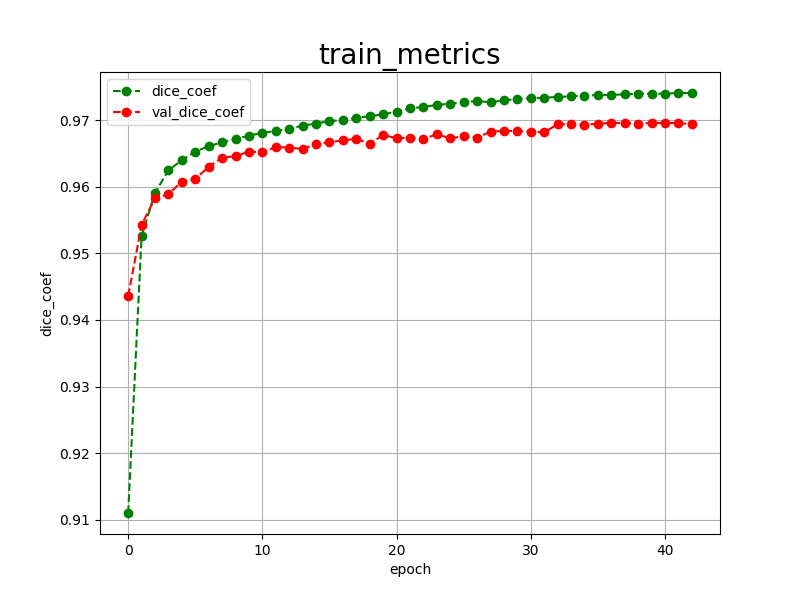
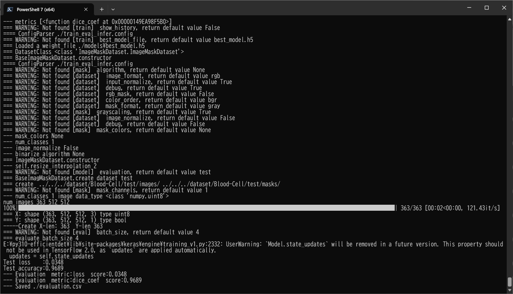

<h2>Tensorflow-Image-Segmentation-Blood-Cell (2024/10/24)</h2>

This is the second experiment for Blood-Cell Segmentation based on the latest 
<a href="https://github.com/sarah-antillia/Tensorflow-Image-Segmentation-API">Tensorflow-Image-Segmentation-API</a>, and
<a href="https://drive.google.com/file/d/1ckCd4L9CoTACSunOJoTudPw0o-FlkMYP/view?usp=sharing">
Blood-Cell-ImageMask-Dataset.zip</a>, which was derived by us from the Blood-Cell-segmentation-dataset
<a href="https://drive.google.com/file/d/1nG-ra6BPAZSTsdYCvedzCo-JLD7jdH71/view?usp=share_link">Final data.zip.</a>
On the original dataset, please see <a href="https://github.com/Deponker/Blood-cell-segmentation-dataset">Deponker/Blood-cell-segmentation-dataset</a> 

 
On detail of the Blood Cell ImageMask Dataset, please refer to our first experiment  
<a href="https://github.com/sarah-antillia/Image-Segmentation-Blood-Cell">Image-Segmentatioin-Blood-Cell</a>
 
 

<b>Actual Image Segmentation for Images of 1600x1200 pixels</b> 
As shown below, the inferred masks look similar to the ground truth masks.  

<table>
<tr>
<th>Input: image</th>
<th>Mask (ground_truth)</th>
<th>Prediction: inferred_mask</th>
</tr>
<tr>
<td></td>
<td></td>
<td></td>
</tr>

<tr>
<td></td>
<td></td>
<td></td>
</tr>

<tr>
<td></td>
<td></td>
<td></td>
</tr>

</table>

We used the simple UNet Model <a href="./src/TensorflowUNet.py">TensorflowSlightlyFlexibleUNet</a> for this Follicular-Cell Segmentation. 
As shown in <a href="https://github.com/sarah-antillia/Tensorflow-Image-Segmentation-API">Tensorflow-Image-Segmentation-API</a>.
you may try other Tensorflow UNet Models: 

<li><a href="./src/TensorflowSwinUNet.py">TensorflowSwinUNet.py</a></li>
<li><a href="./src/TensorflowMultiResUNet.py">TensorflowMultiResUNet.py</a></li>
<li><a href="./src/TensorflowAttentionUNet.py">TensorflowAttentionUNet.py</a></li>
<li><a href="./src/TensorflowEfficientUNet.py">TensorflowEfficientUNet.py</a></li>
<li><a href="./src/TensorflowUNet3Plus.py">TensorflowUNet3Plus.py</a></li>
<li><a href="./src/TensorflowDeepLabV3Plus.py">TensorflowDeepLabV3Plus.py</a></li>
 

<h3>1. Dataset Citation</h3>

The image dataset used here has been taken from the following web site.

Proposed Large Segmentation Dataset Download Link 
2656 images are avilable. 1328 Original blood cell images with 1328 corresponding ground truths. 
https://drive.google.com/file/d/1nG-ra6BPAZSTsdYCvedzCo-JLD7jdH71/view?usp=share_link 

<b>Citation</b> 
title={Automatic segmentation of blood cells from microscopic slides: a comparative analysis}, 
author={Depto, Deponker Sarker and Rahman, Shazidur and Hosen, Md Mekayel and Akter,  
Mst Shapna and Reme, Tamanna Rahman and Rahman, Aimon and Zunair, Hasib and Rahman, M Sohel and Mahdy, MRC}, 
journal={Tissue and Cell}, 
volume={73}, 
pages={101653}, 
year={2021}, 
publisher={Elsevier} 
} 
 

<h3>
<a id="2">
2 Blood-Cell ImageMask Dataset
</a>
</h3>
 If you would like to train this Blood-Cell Segmentation model by yourself,
 please download our blood-cell dataset from the google drive 
<a href="https://drive.google.com/file/d/1ckCd4L9CoTACSunOJoTudPw0o-FlkMYP/view?usp=sharing">
Blood-Cell-ImageMask-Dataset.zip</a>, 
 expand the downloaded dataset and put it under <b>./dataset</b> folder to be

<pre>
./dataset
└─Blood-Cell
    ├─test
    │  ├─images
    │  └─masks
    ├─train
    │  ├─images
    │  └─masks
    └─valid
        ├─images
        └─masks
</pre>
 
 
<b>Blood-Cell Statistics</b> 
 

As shown above, the number of images of train and valid dataset is enough to use for our segmentation model.

 
 
<b>Train_images_sample</b> 

 
<b>Train_masks_sample</b> 

 

<h3>
3. Train Tensorflow UNet Model
</h3>
 We trained Follicular-Cell TensorflowUNet Model by using the configuration file
<a href="./projects/TensorflowSlightlyFlexibleUNet/Blood-Cell/train_eval_infer.config"> <b>train_eval_infer.config</b></a> file.  
Please move to ./projects/TensorflowSlightlyFlexibleUNet/Blood-Cell and run the following bat file. 
<pre>
>1.train.bat
</pre>
, which simply runs the following command. 
<pre>
>python ../../../src/TensorflowUNetTrainer.py ./train_eval_infer.config
</pre>

<b>Model parameters</b> 
Defined a small <b>base_filters</b>, a large <b>base_kernels</b> and a slightly large <b>dilation</b> for the first Conv Layer of Encoder Block of 
<a href="./src/TensorflowUNet.py">TensorflowUNet.py</a> 
and a large num_layers (including a bridge between Encoder and Decoder Blocks).
<pre>
[model]
model          = "TensorflowUNet"
generator      = True
image_width    = 512
image_height   = 512
image_channels = 3
base_filters   = 16
base_kernels   = (7,7)
num_layers     = 7
dilation       = (2,2)
</pre>

<b>Learning rate</b> 
Defined a small learning rate.  
<pre>
[model]
learning_rate  = 0.0001
</pre>

<b>Online augmentation</b> 
Diabled our online augmentation.  
<pre>
[model]
model         = "TensorflowUNet"
generator     = False
</pre>

<b>Loss and metrics functions</b> 
Specified "bce_dice_loss" and "dice_coef". 
<pre>
[model]
loss           = "bce_dice_loss"
metrics        = ["dice_coef"]
</pre>
<b>Learning rate reducer callback</b> 
Enabled learing_rate_reducer callback, and a small reducer_patience.
<pre> 
[train]
learning_rate_reducer = True
reducer_factor     = 0.4
reducer_patience   = 4
</pre>

<b>Early stopping callback</b> 
Enabled early stopping callback with patience parameter.
<pre>
[train]
patience      = 10
</pre>

<b>Mask blurring</b> 
Enabled mask blurring.
<pre>
[mask]
blur      = True
blur_size = (3,3)
</pre>

<b>Epoch change inference callbacks</b> 
Enabled epoch_change_infer and epoch_change_tiledinfer callbacks. 
<pre>
[train]
epoch_change_infer      = True
epoch_change_infer_dir  = "./epoch_change_infer"
epoch_change_tiledinfer = False
epoch_change_tiledinfer_dir = "./epoch_change_tiledinfer"
num_infer_images        = 6
</pre>

By using these callbacks, on every epoch_change, the inference procedures can be called
 for 6 images in <b>mini_test</b> folder. These will help you confirm how the predicted mask changes 
 at each epoch during your training process.    

<b>Epoch_change_inference output</b> 
 
 
 
In this experiment, the training process was terminated at epoch 43.  
 
 
 
<a href="./projects/TensorflowSlightlyFlexibleUNet/Blood-Cell/eval/train_metrics.csv">train_metrics.csv</a> 
 

 
<a href="./projects/TensorflowSlightlyFlexibleUNet/Blood-Cell/eval/train_losses.csv">train_losses.csv</a> 
 
 

<h3>
4.Evaluation
</h3>
Please move to a <b>./projects/TensorflowSlightlyFlexibleUNet/Blood-Cell</b> folder, 
and run the following bat file to evaluate TensorflowUNet model for Follicular-Cell. 
<pre>
./2.evaluate.bat
</pre>
<pre>
python ../../../src/TensorflowUNetEvaluator.py ./train_eval_infer_aug.config
</pre>
Evaluation console output: 

 
The loss (bce_dice_loss) to this Blood-Cell test dataset was low, and dice_coef high as shown below.
 
<pre>
loss,0.0348
dice_coef,0.9689
</pre>

<h2>
5. Inference
</h2>
Please move to a <b>./projects/TensorflowSlightlyFlexibleUNet/Augmented-Follicular-Cell</b> folder 
,and run the following bat file to infer segmentation regions for images by the Trained-TensorflowUNet model for Follicular-Cell. 
<pre>
./3.infer.bat
</pre>
<pre>
python ../../../src/TensorflowUNetInferencer.py ./train_eval_infer_aug.config
</pre>
Sample test images 
 
Sample test mask (ground_truth) 
 

 
Inferred test masks 
 
 

<b>Enlarged images and masks of 1600x1200 pixels</b> 

<table>
<tr>
<th>Image</th>
<th>Mask (ground_truth)</th>
<th>Inferred-mask</th>
</tr>

<tr>
<td></td>
<td></td>
<td></td>
</tr>
<tr>
<td></td>
<td></td>
<td></td>
</tr>
<tr>
<td></td>
<td></td>
<td></td>
</tr>
<tr>
<td></td>
<td></td>
<td></td>
</tr>
<tr>
<td></td>
<td></td>
<td></td>
</tr>
</table>

 

 
<h3>
References
</h3>
<b>1. Automatic segmentation of blood cells from microscopic slides: A comparative analysis</b> 
Deponker Sarker Depto, Shazidur Rahman, Md. Mekayel Hosen, Mst Shapna Akter,  
Tamanna Rahman Reme, Aimon Rahman, Hasib Zunai, M. Sohel Rahman and M.R.C.Mahdy 

<b>Citation</b> 
title={Automatic segmentation of blood cells from microscopic slides: a comparative analysis}, 
author={Depto, Deponker Sarker and Rahman, Shazidur and Hosen, Md Mekayel and Akter, Mst Shapna and Reme,  
Tamanna Rahman and Rahman, Aimon and Zunair, Hasib and Rahman, M Sohel and Mahdy, MRC}, 
journal={Tissue and Cell}, 
volume={73}, 
pages={101653}, 
year={2021}, 
publisher={Elsevier} 
} 

<a href="https://github.com/Deponker/Blood-cell-segmentation-dataset">
https://github.com/Deponker/Blood-cell-segmentation-dataset
</a>

 
 
<b>2.Image-Segmentatioin-Blood-Cell</b> 
Toshiyuki Arai @antillia.com 

<a href="https://github.com/sarah-antillia/Image-Segmentation-Blood-Cell">https://github.com/sarah-antillia/Image-Segmentation-Blood-Cell</a>
 
